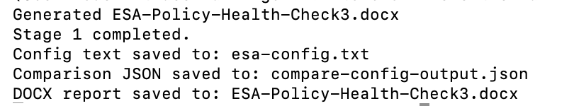
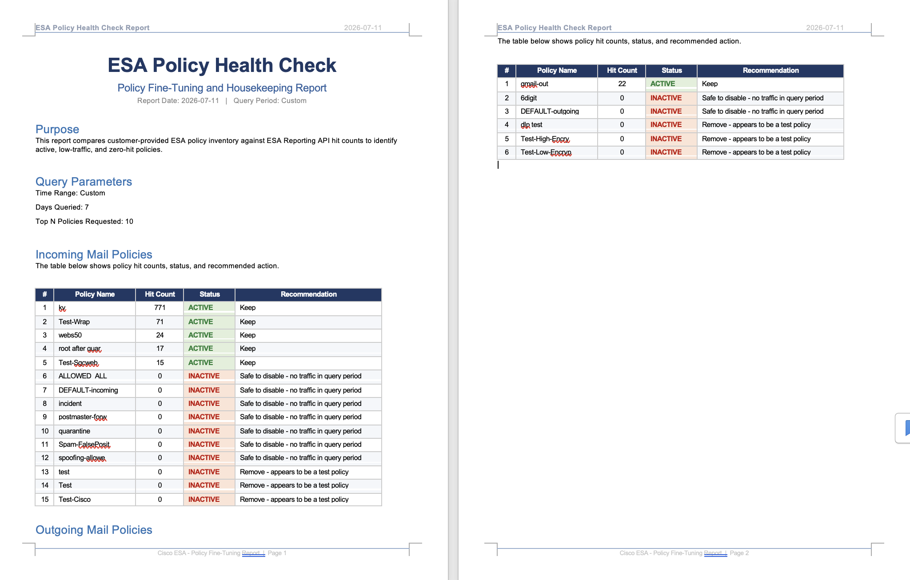

# Cisco ESA Mail Policy Hitcount Reporter

This repository contains Python scripts for querying and analyzing Cisco ESA (Email Security Appliance) mail policy hit counts. It covers two use cases: quick hit count reporting and a full end-to-end policy health check.

While ESA natively provides hit count reporting at the content filter and message filter levels, it does not offer visibility at the mail policy level. These scripts bridge that gap by aggregating and presenting policy-level hit count data.

For an AI-assisted interactive workflow using MCP tooling, see Stage 2:
https://github.com/CiscoDevNet/esa-ces-policy-hitcount-mcp-community

---

## Scripts

### esa_policy_hitcount.py — Quick Hit Count Reporter

A lightweight script that queries incoming and outgoing mail policy hit counts and prints a clean tabular summary. Useful for a quick view of which policies were triggered in a given period.

### sma_policy_hitcount.py — SMA Centralized Reporting Version

Same as above but targets an SMA (Security Management Appliance) with centralized reporting. Use this for environments where ESA reporting is aggregated on an SMA.

### stage1_healthcheck.py — Full Policy Health Check (New)

An end-to-end health check script that goes beyond hit count reporting. It:
1. Collects the full policy inventory from ESA (via API config export, local config file, or SSH `policyconfig`)
2. Queries hit counts for the target time period
3. Compares the config inventory against hit data to identify:
   - Policies with hits (active policies)
   - Policies with zero hits (unused/inactive policies — candidates for review or cleanup)
   - Policies in API hits that are not in config inventory
4. Saves a JSON comparison output
5. Generates a DOCX health check report via `generate-health-report.js`

---

## Features

- Query incoming and outgoing mail policies
- Summarize policy name → hit count
- Configurable time range (number of days to query)
- Configurable top-N policies to retrieve
- Basic Authentication
- Clean tabular output (quick scripts) or structured JSON + DOCX report (health check)
- Policy inventory collection via ESA API, local file, or SSH CLI (`policyconfig`)
- Zero-hit policy identification for policy housekeeping

---

## Requirements

- Python 3.8+ (3.11+ recommended for `stage1_healthcheck.py`)
- `requests` library (all scripts)
- `paramiko` library (required for `stage1_healthcheck.py` SSH collection)
- `urllib3` (required for `stage1_healthcheck.py`)
- Node.js — used by `generate-health-report.js` to render the final Word document (`.docx`) from the comparison JSON. This is the last step of the `stage1_healthcheck.py` workflow.

Install Python dependencies:

```
pip install requests paramiko urllib3
```

Install Node.js report generator dependencies (run once in the repo directory):

```
npm install
```

---

## Requirements on ESA

- Enable API (from Network -> IP Interfaces -> AsyncOS API)
- Create an API user credential with read permission
- For SSH collection: SSH access to ESA CLI with a user that can run `policyconfig`

---

## Quick Hit Count — Configuration and Usage

### esa_policy_hitcount.py

Edit the user parameters at the top of the script:

```python
ESA_IP = "x.x.x.x"         # ESA IP or hostname
ESA_PORT = 6080             # ESA API port (default API HTTP)
API_USER = "xxxxx"          # API username
API_PASS = "xxxxx"          # API password
DAYS_TO_QUERY = 1           # Number of days to query
TOP_N_POLICIES = 10         # Top N policies to retrieve
VERIFY_SSL = False          # True if ESA has a valid SSL cert
```

Run:

```
python esa_policy_hitcount.py
```

Sample output:

```
ESA Report: Incoming Policy Hitcounts Matched - last 1 day(s)
Time Range: 2026-03-30T18:00:00.000Z -> 2026-03-31T18:00:00.000Z

Policy1                           129
Policy2                             7
Quarantine Policy                   6
Test-Policy                         5
postmaster-forwarding               4
Spam-FalsePositive                  2
spoofing-allowed                    2

ESA Report: Outgoing Policy Hitcounts Matched - last 1 day(s)
Time Range: 2026-03-30T18:00:00.000Z -> 2026-03-31T18:00:00.000Z

Default-out                         9
```

### sma_policy_hitcount.py

Same usage pattern as above. Update the user parameters at the top of the script to point to the SMA IP and credentials.

---

## Policy Health Check — stage1_healthcheck.py

### Prerequisites

- ESA API credentials with reporting access
- One of the following for policy inventory:
  - ESA config export file (local text file)
  - ESA config API endpoint
  - SSH access to ESA CLI (`policyconfig`)
- Node.js installed with `npm install` run in the repo directory

### Usage Options

**Option 1 — Collect policy inventory via SSH (recommended if API config export is not available):**

```
python3 stage1_healthcheck.py \
  --esa-ip <ESA_IP> \
  --api-user <API_USER> \
  --api-pass <API_PASS> \
  --fetch-via-ssh \
  --days 30 \
  --top 1000 \
  --docx-output ESA-Policy-Health-Check.docx
```

**Option 2 — Use a local ESA config XML file:**

Export the ESA configuration from the GUI (System Administration -> Configuration File -> Save current configuration) and provide the saved `.xml` file.

> **Important — Data Privacy:** When saving the configuration file, select **"Mask passphrases"** (hash) rather than the encrypted option. This ensures passwords and passphrases are not recoverable from the exported XML. Do not share or commit a config file with encrypted credentials.

```
python3 stage1_healthcheck.py \
  --esa-ip <ESA_IP> \
  --api-user <API_USER> \
  --api-pass <API_PASS> \
  --config-file /path/to/esa-config.xml \
  --days 30 \
  --top 1000 \
  --docx-output ESA-Policy-Health-Check.docx
```

### All Arguments

| Argument | Default | Description |
|---|---|---|
| `--esa-ip` | required | ESA IP or hostname |
| `--esa-port` | 6080 | ESA API port |
| `--api-user` | required | ESA API username |
| `--api-pass` | required | ESA API password |
| `--days` | 30 | Days to query for hit counts |
| `--top` | 1000 | Top N policies to request from API |
| `--verify-ssl` | off | Enable SSL verification |
| `--fetch-via-ssh` | off | Collect policy inventory via SSH `policyconfig` |
| `--ssh-port` | 22 | ESA SSH port |
| `--config-file` | — | Local ESA config XML file path (`esa-config.xml`) |
| `--config-output` | esa-config.txt | Where to save collected config text |
| `--compare-output` | compare-config-output.json | Where to save comparison JSON |
| `--docx-output` | ESA-Policy-Health-Check.docx | Output DOCX health report file |

### Output Files

- `esa-config.txt` — collected/fetched config text
- `compare-config-output.json` — structured comparison data (policies with hits, without hits, API-only)
- `ESA-Policy-Health-Check.docx` — formatted health check report

### Sample Run Output

Runtime output sample:



Generated DOCX sample:



---

## How It Works

### Quick Scripts (esa_policy_hitcount.py / sma_policy_hitcount.py)

1. Calculate start and end time based on `DAYS_TO_QUERY`
2. Construct ESA/SMA API URLs for incoming and outgoing mail policies
3. Use Basic Authentication to query ESA v2 API
4. Process returned JSON (`{policy_name: hit_count}` mapping)
5. Print each policy and hit count in a clean table

### Health Check (stage1_healthcheck.py)

1. Collect policy inventory from ESA (SSH, local file, or API)
2. Query hit counts from ESA reporting API for the target period
3. Aggregate and normalize policy names
4. Compare config inventory against API hit data
5. Produce structured JSON with `policies_with_hits`, `policies_without_hits`, and `api_only_policies`
6. Pass JSON to `generate-health-report.js` to produce a DOCX report

---

## Notes

- Hit count represents how many times a policy was triggered (per recipient) in the selected time range.
- ESA API limits results with `top=N`. Increase `--top` if you have many policies.
- The API only returns policies that had hits in the queried period. The health check script identifies zero-hit policies by comparing the full config inventory against API results.
- Set `--verify-ssl` if using HTTPS with a valid certificate. Without it, SSL warnings are suppressed.
- All time queries use UTC.

---

## Updates

**July 2026** — Added `stage1_healthcheck.py` for end-to-end policy health check with zero-hit policy identification and DOCX report generation.

**May 2026** — Added `sma_policy_hitcount.py` for environments with SMA centralized reporting.

---

## Author

ciscoketcheon — ketcheon@cisco.com

---

## Suggested Improvements

- Export quick script results to CSV or JSON
- Automatic pagination for more than `top=N` results
- Token-based authentication instead of Basic Auth
- Full SSL support (currently HTTP API recommended)
- Scheduled/recurring health check runs

- 
## Licensing

Copyright (c) 2020-2026 Cisco and/or its affiliates.

Licensed under the Apache License, Version 2.0 (the "License");
you may not use this file except in compliance with the License.
You may obtain a copy of the License at

    http://www.apache.org/licenses/LICENSE-2.0

Unless required by applicable law or agreed to in writing, software
distributed under the License is distributed on an "AS IS" BASIS,
WITHOUT WARRANTIES OR CONDITIONS OF ANY KIND, either express or implied.
See the License for the specific language governing permissions and
limitations under the License.
